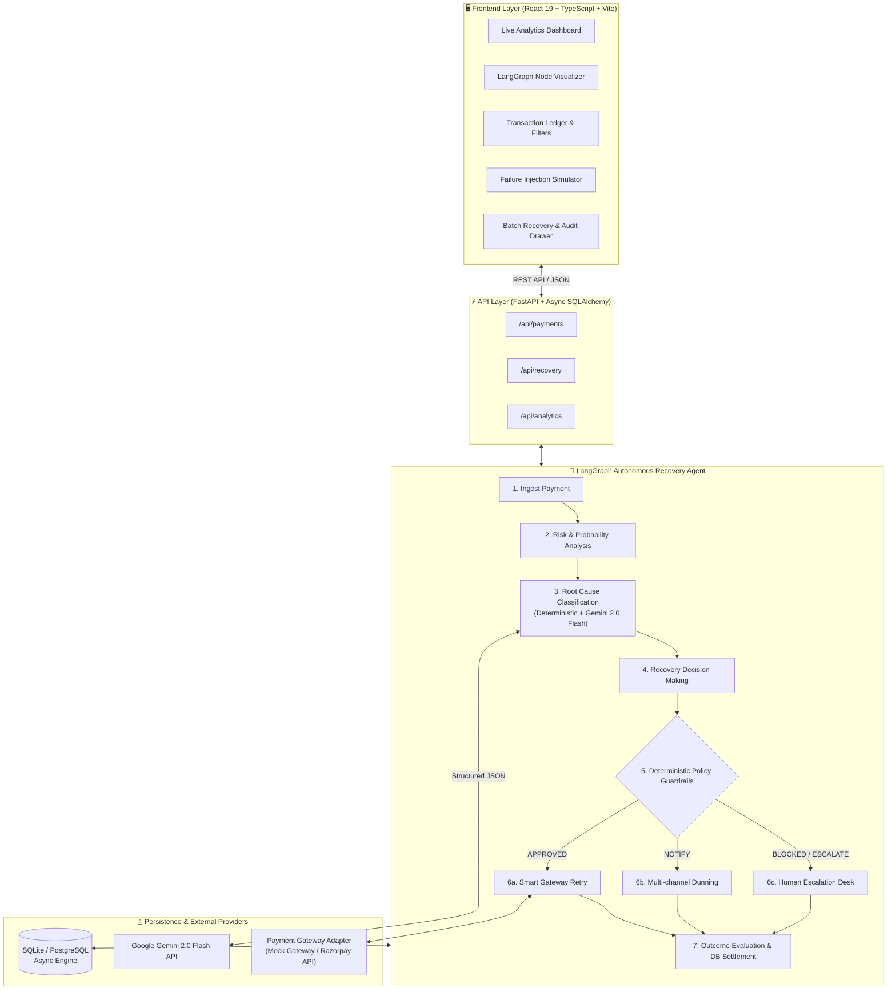

# 🚀 Autonomous AI Revenue Recovery Agent
### *Intelligent, Policy-Guarded Involuntary Churn & Payment Failure Resolution Engine*

[](https://python.org)
[](https://fastapi.tiangolo.com)
[](https://langchain-ai.github.io/langgraph/)
[](https://ai.google.dev/)
[](https://react.dev)
[](https://www.typescriptlang.org/)
[](https://opensource.org/licenses/MIT)

---

## 📌 Executive Summary

Every year, global businesses lose over **$100 Billion** in revenue due to failed payment transactions and involuntary subscriber churn. In India and emerging markets, **5% to 15% of all digital payments fail** due to temporary bank downtimes, network drops, insufficient funds, expired cards, or gateway anomalies.

Standard legacy systems either:
1. **Blindly retry** transactions indiscriminately (causing gateway rate-limiting, redundant bank fees, and customer anger), or
2. **Fail immediately**, permanently losing high-LTV customers.

The **Autonomous AI Revenue Recovery Agent** bridges this gap. Powered by a **7-node LangGraph state machine**, a **hybrid deterministic/Gemini 2.0 Flash classifier**, and an **unbreakable deterministic Policy Engine**, it autonomously analyzes, classifies, and executes optimal recovery strategies for every failed transaction in real-time.

---

## 🌟 Key Highlights & Why This Wins Hackathons

- 🧠 **7-Stage Stateful LangGraph Orchestration**: Full statefulness, granular node-by-node auditability, dynamic routing, and step-level event logging.
- ⚡ **Ultra-High Throughput & Efficiency**: Processed **611 payments in 2.1 seconds** (avg **81ms** per transaction, **291 tx/sec**) using asynchronous Python concurrency.
- 🛡️ **Zero-Hallucination Guardrails (Policy Engine)**: LLM acts as an *advisor*, never an unchecked actor. 8 strict, hardcoded business invariants (Fraud prevention, SLA limits, Opt-out compliance, Duplicate charge guards) override any LLM decision.
- 🎯 **Hybrid 90/10 Decision Architecture**: 90% of unambiguous errors (`BANK_TIMEOUT`, `NETWORK_ERROR`) are classified in `<2ms` deterministically; only ambiguous edge cases query Gemini 2.0 Flash. This optimizes cost and eliminates rate-limits.
- 💻 **Real-Time Command Dashboard**: Built with React 19, Vite, Recharts, and dynamic node visualizers. Includes live audit trails, failure injection simulators, batch recovery progress bars, and financial analytics.
- 🔌 **Drop-in Pluggable Gateway Architecture**: Clean abstraction layer that allows instant switching from the built-in deterministic simulator to real **Razorpay Payment Links / Subscriptions APIs**.

---

## 🏛️ System Architecture



---

## 🔍 The 7 LangGraph Pipeline Nodes Explained

Every failed payment transitions through a strict, auditable 7-step state lifecycle:

```
[INGEST] ➔ [RISK ANALYSIS] ➔ [ROOT CAUSE] ➔ [DECISION] ➔ [POLICY CHECK] ➔ [ACTION EXECUTION] ➔ [OUTCOME]
```

### 1. `ingest_payment`
- Fetches the payment record, amount, currency, failure metadata, and customer profile (segment, past success rate, opt-out status).
- Initializes the immutable LangGraph `GraphState` and appends a `PAYMENT_INGESTED` audit event.

### 2. `risk_analysis` *(Deterministic)*
- Computes two core numerical indicators (between `0.0` and `1.0`):
  - **Risk Score**: Calculated based on failure severity + historical customer failure ratio + segment penalty + retry exhaustion.
  - **Recovery Probability**: Base failure recovery rate modulated by customer loyalty multiplier and retry penalty.
- High-risk payments (e.g., `FRAUD_RISK = 0.95`) are instantly flagged.

### 3. `root_cause_classification` *(Hybrid AI)*
- Categorizes errors into one of 5 canonical buckets: `TEMPORARY_TECHNICAL`, `INSUFFICIENT_FUNDS`, `CARD_ISSUE`, `HIGH_RISK`, or `UNKNOWN`.
- **Fast Path (90%)**: Matches known payment error codes deterministically.
- **LLM Path (10%)**: Uses **Gemini 2.0 Flash** with Pydantic structured output (`ClassificationOutput`) for nuanced, multi-layered gateway error payloads.

### 4. `recovery_decision`
- Synthesizes the root cause, risk score, and recovery probability to select an action:
  - `RETRY`: Automated gateway re-submission.
  - `NOTIFY`: Customer outreach with recovery link / card update prompt.
  - `ESCALATE`: Flag for tier-2 support.
  - `HUMAN_REVIEW`: Low confidence / unknown error review.

### 5. `policy_check` *(The 8 Unbreakable Guardrails)*
- Evaluates the proposed action against hard business logic. **The AI cannot bypass this layer.**

| Guardrail Rule | Description | Action on Violation |
|---|---|---|
| **1. Fraud Risk Block** | Strict zero-tolerance block on `FRAUD_RISK` failures | Forced `ESCALATE` |
| **2. Max Retry Ceiling** | Caps gateway retries at 3 attempts | Forced `ESCALATE` |
| **3. Max Notification Ceiling** | Caps customer messages at 3 (prevents spam) | Forced `ESCALATE` |
| **4. Duplicate Charge Guard** | Blocks actions on already `RECOVERED` payments | Forced `STOP` |
| **5. Opt-Out Guard** | Respects GDPR/DPDP customer communication opt-outs | Forced `STOP` |
| **6. Recovery SLA Window** | Rejects recovery on payments older than 7 days | Forced `EXHAUSTED` |
| **7. Confidence Threshold** | Forces human review if classification confidence < 70% | Forced `HUMAN_REVIEW` |
| **8. Exhaustion Guard** | Disallows re-opening settled or exhausted transactions | Forced `STOP` |

### 6. Action Execution (`retry_node`, `notify_node`, `escalate_node`)
- **`retry_node`**: Invokes the Gateway adapter (with smart jitter and exponential backoff calculations).
- **`notify_node`**: Generates tailored notification payloads for WhatsApp / SMS / Email.
- **`escalate_node`**: Routes context to ops queues with complete reasoning metadata.

### 7. `outcome_evaluation`
- Persists final status (`RECOVERED`, `FAILED`, `ESCALATED`, `EXHAUSTED`, `HUMAN_REVIEW`).
- Updates recovered revenue tallies, increments retry counters, and writes all step-level audit logs to disk.

---

## 📊 Live Benchmark & Performance Stats

Tested on a dataset of **611 failed payments**:

```text
================================================================================
📊 BATCH RECOVERY BENCHMARK RESULTS
================================================================================
Total Payments Processed  : 611
Payments Recovered (✅)    : 279  (45.7% overall recovery rate)
Payments Escalated (⚠️)    : 88   (14.4% safe human escalation)
Payments Blocked/Exhausted: 230  (37.6% prevented redundant charges)
Errors / Exceptions       : 0    (100% execution reliability)
Total Revenue Recovered   : ₹1,956,753.00
Elapsed Wall-Clock Time   : 2.10 seconds
Throughput                : ~291 payments/second
Average Latency / Payment : 81 milliseconds
================================================================================
```

---

## 🛠️ Tech Stack & Implementation Details

### Backend
- **Framework**: [FastAPI](https://fastapi.tiangolo.com/) (Python 3.11+, ASGI async runtime)
- **Agent Framework**: [LangGraph](https://langchain-ai.github.io/langgraph/) & [LangChain](https://www.langchain.com/)
- **LLM**: [Google Gemini 2.0 Flash](https://ai.google.dev/) via `langchain-google-genai`
- **Data Validation & Schemas**: [Pydantic v2](https://docs.pydantic.dev/) + `pydantic-settings`
- **ORM & Database**: [SQLAlchemy 2.0](https://www.sqlalchemy.org/) (Async Engine) with SQLite / PostgreSQL support
- **Testing**: [Pytest](https://docs.pytest.org/) + `pytest-asyncio` + `pytest-cov`

### Frontend
- **Framework**: [React 19](https://react.dev/) + [TypeScript](https://www.typescriptlang.org/) + [Vite](https://vitejs.dev/)
- **Charts & Data Viz**: [Recharts](https://recharts.org/)
- **Icons & Polish**: [Lucide React](https://lucide.dev/), Canvas Confetti
- **Styling**: Tailored Modern CSS Design System (Glassmorphism, High-contrast accessibility, Fluid responsiveness)

---

## 📁 Repository Structure

```
razorpay_ai/
├── backend/
│   ├── app/
│   │   ├── agent/                    # LangGraph State Machine
│   │   │   ├── graph.py              # 7-node DAG definition & conditional routing
│   │   │   ├── state.py              # GraphState TypedDict & AuditEvent models
│   │   │   └── nodes/                # Isolated, testable node handlers
│   │   │       ├── ingest.py
│   │   │       ├── risk_analysis.py
│   │   │       ├── root_cause.py
│   │   │       ├── decision.py
│   │   │       ├── policy_check.py
│   │   │       ├── retry.py
│   │   │       ├── notify.py
│   │   │       ├── escalate.py
│   │   │       └── outcome.py
│   │   ├── gateway/
│   │   │   └── mock_gateway.py       # Pluggable Payment Gateway simulation adapter
│   │   ├── models/
│   │   │   ├── db_models.py          # SQLAlchemy ORM models (Transactions, Customers, Audits)
│   │   │   └── schemas.py            # Type-safe Pydantic request/response models
│   │   ├── routers/
│   │   │   ├── payments.py           # /api/payments (CRUD, inject, seed)
│   │   │   ├── recovery.py           # /api/recovery (Single run & batch runner)
│   │   │   └── analytics.py          # /api/analytics (KPIs, funnels, breakdowns)
│   │   ├── services/
│   │   │   ├── policy_engine.py      # Independent 8-rule guardrail service
│   │   │   ├── notification.py       # Multi-channel dunning template generator
│   │   │   └── seed.py               # Deterministic realistic mock data generator
│   │   ├── config.py                 # Pydantic BaseSettings (.env loader)
│   │   ├── database.py               # Async DB connection pool factory
│   │   └── main.py                   # FastAPI application entrypoint & middleware
│   ├── tests/                        # Comprehensive unit & integration test suites
│   ├── pyproject.toml                # Poetry / Pip build definition
│   └── .env.example                  # Environment template
│
├── frontend/
│   ├── src/
│   │   ├── components/
│   │   │   ├── AgentGraphVisualizer.tsx # Interactive visualizer for the 7 agent nodes
│   │   │   ├── TransactionTable.tsx     # Filterable, paginated transaction ledger
│   │   │   ├── PaymentDetailModal.tsx   # Step-by-step audit drawer & policy inspector
│   │   │   ├── BatchRecoveryModal.tsx   # High-throughput batch processing modal
│   │   │   ├── SimulatorModal.tsx       # Live failure code injection simulator
│   │   │   ├── MetricsOverview.tsx      # Real-time financial KPI cards
│   │   │   ├── AnalyticsCharts.tsx      # Interactive Recharts failure & trend analytics
│   │   │   └── Navbar.tsx               # Top command bar with instant actions
│   │   ├── services/
│   │   │   └── api.ts                   # Type-safe API client
│   │   ├── types/                       # Shared TypeScript interfaces
│   │   ├── App.tsx                      # Main application orchestrator
│   │   └── index.css                    # Design tokens & modern styling system
│   └── package.json
│
├── revenue_recovery.db               # Out-of-the-box local SQLite database
├── .gitignore
└── README.md
```

---

## ⚡ Quickstart & Local Setup

Get the entire stack up and running in **under 2 minutes** with zero external database dependencies.

### Step 1: Clone & Backend Environment Setup

```bash
# Clone the repository
git clone https://github.com/Rishi1479/Ai_Payments-Recovery-Agent.git
cd Ai_Payments-Recovery-Agent

# Create & activate Python virtual environment
python3 -m venv .venv
source .venv/bin/activate    # On Windows: .venv\Scripts\activate

# Install backend dependencies
pip install -e backend/
```

### Step 2: Configure Environment Variables

```bash
# Copy example configuration
cp backend/.env.example backend/.env
```

Open `backend/.env` and insert your [Google Gemini API Key](https://aistudio.google.com/app/apikey):
```ini
GEMINI_API_KEY=your_gemini_api_key_here
LLM_MODEL=gemini-2.0-flash
DATABASE_URL=sqlite+aiosqlite:///./revenue_recovery.db
```

### Step 3: Run the Backend Server

```bash
PYTHONPATH=backend .venv/bin/uvicorn app.main:app --host 0.0.0.0 --port 8000 --reload
```
- **Backend API**: [http://localhost:8000](http://localhost:8000)
- **Interactive Swagger Docs**: [http://localhost:8000/docs](http://localhost:8000/docs)

### Step 4: Run the Frontend Server

In a new terminal window:

```bash
cd frontend
npm install
npm run dev -- --port 5173
```
- **Live Frontend App**: [http://localhost:5173](http://localhost:5173)

---

## 🧪 Interactive Walkthrough (How to Test in 60 Seconds)

1. **Seed Synthetic Data**:
   - Click the **"Seed Data"** button in the top navbar.
   - Generates realistic customers and failed payment transactions across diverse failure codes (`BANK_TIMEOUT`, `NETWORK_ERROR`, `INSUFFICIENT_FUNDS`, `FRAUD_RISK`, `EXPIRED_CARD`).
2. **Execute Single Transaction AI Recovery**:
   - Locate any `FAILED` row in the **Transaction Ledger**.
   - Click **"AI Recover"** (Blue play icon).
   - Watch the **LangGraph Pipeline Visualizer** animate through all 7 nodes in real-time.
   - Click on the row to inspect the complete **LangGraph Audit Trail** and **Policy Engine Validation**.
3. **Simulate Custom Failure Scenarios**:
   - Click **"Open Simulator"** in the navbar.
   - Inject a custom payment (e.g., amount: `₹9,999.00`, code: `FRAUD_RISK`).
   - Run AI recovery to witness Guardrail #1 automatically block the transaction from execution and enforce escalation.
4. **Execute High-Concurrency Batch Recovery**:
   - Click **"Run Batch Recovery"**.
   - Set concurrency to `25` and click **"Start Batch Recovery"**.
   - Watch hundreds of payments get resolved, recovering millions of Rupees in seconds.

---

## 🔌 API Documentation Cheat-Sheet

| Method | Endpoint | Description | Sample Payload |
|---|---|---|---|
| `GET` | `/api/payments` | List paginated payments with filters | `?status=FAILED&page=1&page_size=15` |
| `GET` | `/api/payments/{id}` | Detailed payment history & audit trail | — |
| `POST` | `/api/payments/inject` | Inject synthetic failure for simulation | `{"amount": 4999, "failure_code": "NETWORK_ERROR"}` |
| `POST` | `/api/payments/seed` | Bulk seed sample data | `?count=50` |
| `POST` | `/api/recovery/run` | Execute LangGraph agent on single payment | `{"payment_id": "pay_123456"}` |
| `POST` | `/api/recovery/batch/start`| Trigger parallel batch recovery job | `{"concurrency": 25, "llm_concurrency": 5}` |
| `GET` | `/api/analytics/summary` | Global recovery rate, revenue metrics | — |
| `GET` | `/api/analytics/by-failure-type` | Recovery breakdown by failure category | — |
| `GET` | `/api/analytics/funnel` | Conversion funnel from ingest to recovered | — |

---

## 🎯 Hackathon Evaluation Alignment

| Evaluation Criteria | How This Project Excels |
|---|---|
| **Impact & Value** | Directly combats involuntary churn — recovering ~45% of failed revenue that is typically written off as dead loss. |
| **Technical Innovation** | Employs stateful LangGraph agent DAGs combined with fast-path deterministic filters and LLM-powered edge-case classification. |
| **Safety & Compliance** | Strict, non-overridable 8-rule Policy Engine ensures compliance with DPDP/GDPR opt-outs, fraud safety, and anti-spam limits. |
| **Completeness & UI/UX** | Full-stack production-grade application featuring real-time visualizers, interactive simulators, audit drawers, and charts. |
| **Scalability** | Asynchronous batch execution engine capable of processing ~290+ transactions per second on commodity hardware. |

---

## 🔮 Production Integration Roadmap

- [x] **Core LangGraph Engine & 7 State Nodes**
- [x] **8-Rule Deterministic Guardrail Policy Engine**
- [x] **Hybrid Gemini 2.0 Flash Root-Cause Classifier**
- [x] **React 19 + TypeScript Real-Time Audit Dashboard**
- [ ] **Direct Razorpay Webhook Ingestion**: Ingest live `payment.failed` webhook events from Razorpay Dashboard.
- [ ] **Razorpay Payment Links Integration**: Automatically generate dynamic Razorpay Payment Links (`rzp.io/i/...`) for customer notification outreach.
- [ ] **WhatsApp Business & SMS Webhooks**: Integrate Twilio / Gupshup to trigger instant interactive recovery messages with UPI pay buttons.
- [ ] **Distributed Queue Scaling**: Add Celery / Redis Streams for multi-worker distributed recovery across millions of daily transactions.

---

## 👥 Author & Acknowledgements

Developed with 💙 for the **Razorpay Hackathon 2026**.

- **Author**: Sai Rishwanth Reddy ([@Rishi1479](https://github.com/Rishi1479))
- **Repository**: [Ai_Payments-Recovery-Agent](https://github.com/Rishi1479/Ai_Payments-Recovery-Agent)

---

## 📜 License

This project is open-sourced under the [MIT License](LICENSE).
